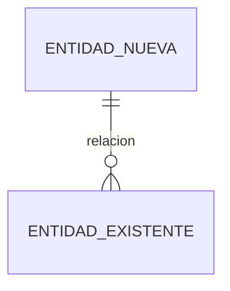

# Capa de datos: {titulo del diseño}

> Artefacto de primera clase del diseño (hermano de pipeline.md y brief.md). El cimiento del que cuelgan procesos, arquitectura y UI. Conducido por Dexter [MD].
> Estilo: NARRATIVA DE DECISION PRIMERO, tabla como anexo de precisión. Cada sección cuenta la historia del dato y termina pidiendo acuerdo.

> **Bloques proyectados.** Lo delimitado por `<!-- modelo:start vista=X -->` y
> `<!-- modelo:end -->` se regenera desde el modelo; lo de afuera se escribe a mano y
> sobrevive. Un bloque por vista y por archivo. Si un marcador queda huerfano (start sin
> end, o al reves) o duplicado, el anfitrion **no escribe** y lo reporta: un reemplazo a
> ciegas sobre un delimitador roto se come prosa que los marcadores existen para proteger.
>
> **Prosa anclada.** Los bloques que explican un nodo lo declaran con
> `<!-- nodo: {id} -->` en su propia linea. `agentos modelo validar` reclama ese
> marcador para toda entidad nueva resuelta, y reporta el marcador que nombre un
> nodo que el modelo no tiene. La prosa que NO es de un nodo —el E/R, las derivas,
> el sello— no lleva marcador y eso esta bien.

## 0. Diagrama E/R

{El cimiento. Entidades nuevas + existentes tocadas. Las existentes se marcan como tales.}

<!-- modelo:start vista=datos -->
<!-- Lo que hay entre estos marcadores se PROYECTA del modelo con
     `agentos modelo proyectar --slug {slug} --vista datos`.
     No editarlo a mano: la proxima emision lo regenera entero.
     Lo de afuera (el E/R, las derivas, el sello) es de Dexter y sobrevive. -->
<!-- modelo:end -->

## Justificacion de las estructuras nuevas

{Una seccion por cada entidad que el bloque proyectado lista como nueva. El QUE sale
del modelo; el POR QUE no cabe en un campo y vive aqui. Cada bloque se ancla al nodo
que explica con `<!-- nodo: {id} -->`, y un marcador puede nombrar varios ids separados
por coma cuando la razon pertenece a mas de uno.}

<!-- nodo: {id-de-la-entidad} -->
{Por que esta tabla/campo es necesario y por que no es redundante con lo que ya existe.
Es lo que el sello anti-evasion pide como "justificacion de no-redundancia", y aqui queda
anclado al nodo en vez de suelto en un checkbox.}

## 6. Derivas observadas

{De la memoria de Dexter [OD]. Inconsistencias históricas tocadas por este diseño y su estado de decisión.}

| Deriva | Tablas | Estado | Decisión |
|--------|--------|--------|----------|

## Sello de persistencia resuelta (anti-evasión)

{Dexter certifica antes del cierre (P-D3): 0 marcadores de evasión, diccionario completo sin placeholders, toda estructura nueva justificada. Al certificar, setear persistencia_resuelta: true en frontmatter. Sin este sello, el brief NO cierra.}

- [ ] 0 marcadores de evasión ("allí veremos", "sugerencia:", "TBD", "por definir", "pendiente", "diferido", "capa futura", "...").
- [ ] Diccionario completo: cada columna con tipo, null, PK/FK pobladas.
- [ ] Toda tabla/campo nuevo con justificación de no-redundancia.
- [ ] Discernimientos de integridad resueltos (no diferidos).

Certificado por Dexter el {fecha}.
