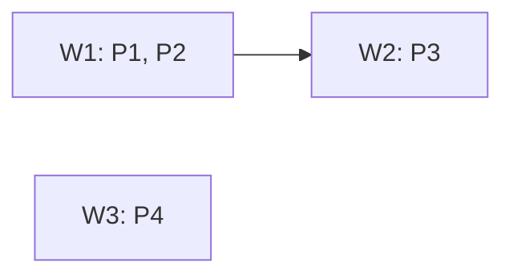

# Fragmentación: {titulo del diseño}

> Cada work es una **rebanada vertical** por subproceso: atraviesa DB + lógica + API +
> frontend de SU(s) subproceso(s) y es desplegable de forma autónoma. PROHIBIDO fragmentar
> por capa técnica (un work nunca es "el de la DB" o "el de las APIs").

## Grafo de dependencias (DAG)

(Flechas = dependencia DURA. Works sin flecha entre sí = paralelos, dependencia blanda.)

## Detalle por work

> **Bloque proyectado.** Lo delimitado por `<!-- modelo:start vista=X -->` y
> `<!-- modelo:end -->` sale del modelo con
> `agentos modelo proyectar --slug {slug} --vista {X}` y **no se edita a mano**:
> la fuente son los nodos `work` y las aristas `CONTIENE`, y las dependencias
> las deriva el runtime de las transiciones que cruzan de un work a otro.

<!-- modelo:start vista=fragmentacion -->
_(se reemplaza con `agentos modelo proyectar --slug {slug} --vista fragmentacion`)_
<!-- modelo:end -->

## Justificación anti-capa

Esta sección **no se proyecta**: es juicio del experto y el grafo no la
contiene. Una fila por work, diciendo qué capas toca y por qué despliega solo.

| Work | Qué capas toca y por qué despliega solo |
|------|------------------------------------------|
| W1   | {ej. "Solicitud + validación: tabla solicitudes, BL de creación, endpoint POST, página del médico. Desplegable: el médico ya puede solicitar aunque no exista despacho."} |
| W2   | {ej. "Despacho consume solicitudes de W1; tabla despachos, BL, endpoint, página del farmaceuta."} |
