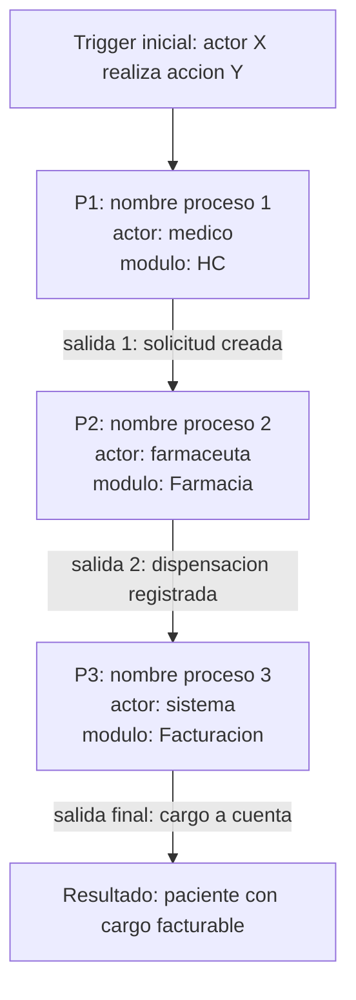

# Pipeline integrador

> Diagrama de procesos encadenados. La salida del proceso Pn es la entrada del Pn+1 (o un subset, si hay branching).

> **Bloques proyectados.** Lo delimitado por `<!-- modelo:start vista=X -->` y
> `<!-- modelo:end -->` sale del modelo con
> `agentos modelo proyectar --slug {slug} --vista {X}` y **no se edita a mano**:
> la fuente son las aristas `TRANSICION`. Lo de afuera es del experto.

## Diagrama

## Tabla resumen

<!-- modelo:start vista=pipeline -->
_(se reemplaza con `agentos modelo proyectar --slug {slug} --vista pipeline`)_
<!-- modelo:end -->

## Branching y bucles

{Si el pipeline tiene caminos alternativos, descrito aqui. Ej: "si el dato X no llega, P2 se omite y va directo a P3 con flag fallback".}
